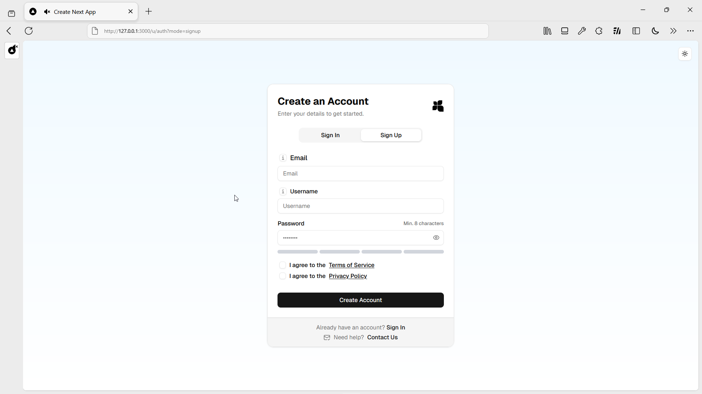

# Supabase Authentiation (Email Provider)

## 🍁 Overview

This repository features a full authentication setup (Sign-in/Sign-up, forgot password with link or OTP, email verification with magic link) as well as a proper middleware setup in Next.js. The setup works locally as well, if you are on windows you can use `sd-dev.ps1`. It has the following features

### 💻 Technolgoies

     

1. **Language**: Typescript
2. **Backend**: [Next.js 15](https://nextjs.org/) + [Supabase](https://www.supabase.com/)
3. **Frontend**: [Next.js 15](https://nextjs.org/) + UI Components via [`shadcn/ui`](https://ui.shadcn.com/) + Tailwind
4. Redis for rate limiting via Upstash

## 🚀 Features

- Full authentication setup with email provider
- Good UI Template
- Email verification (Magic Links) and password forgot functionality (Link or OTP)
- Password strength checker with Zod regex
- Proper query parameters and error handling
- Uses PKCE flow 
- Checks for existing credentials
- Middleware that handles all necessary redirect cases

## 🤝 Flow

- New signup -> verify email -> onboarding
- New signup -> close browser -> open app -> redirected to signin -> signin (unconfirmed) -> redirected to verify email -> resend email -> verify email -> onboarding
- New signup -> close browser -> open app -> redirected to signin -> signin (confirmed, not onboarded) -> onboarding
- Login (already onboarded) -> goes to dashboard.
- Login (already onboarded) -> password reset -> new password setup -> login with new password
- Login (unconfirmed) -> verify email -> resend if need -> login with verified email
- Forgot password (unconfirmed) -> password reset -> new password setup -> login with new password (No verification)
- Forgot password (confirmed) -> password reset -> new password setup -> login with new password (No verification)

With magic link after sign-up it hits `/api/auth/confirm` and verifies then redirects to onboarding

## 📱 Screenshots

## 📄 Additional Notes

- See LICENSE
- When forgot password is done successfully there is no need to verify email again.
- Feel free to raise issues if you notice anything wrong
- For the onboarding you need to add it in your supabase `users` or equivalent table, you can discard that part as per your needs